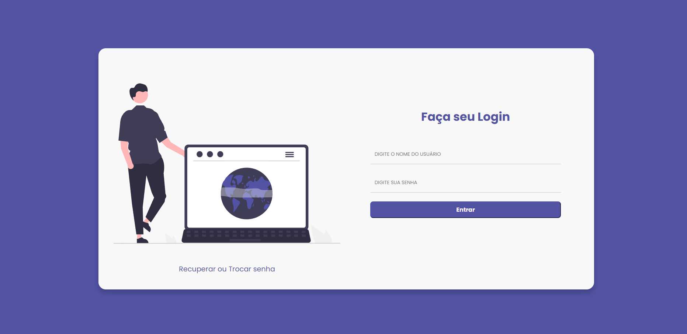
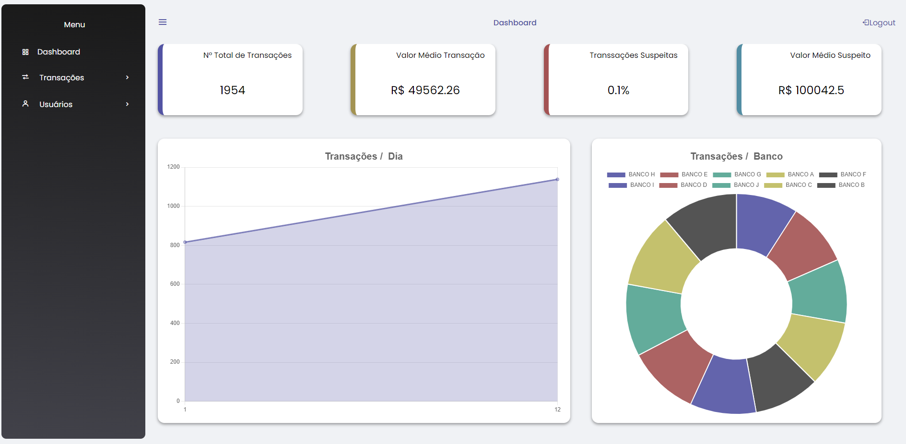
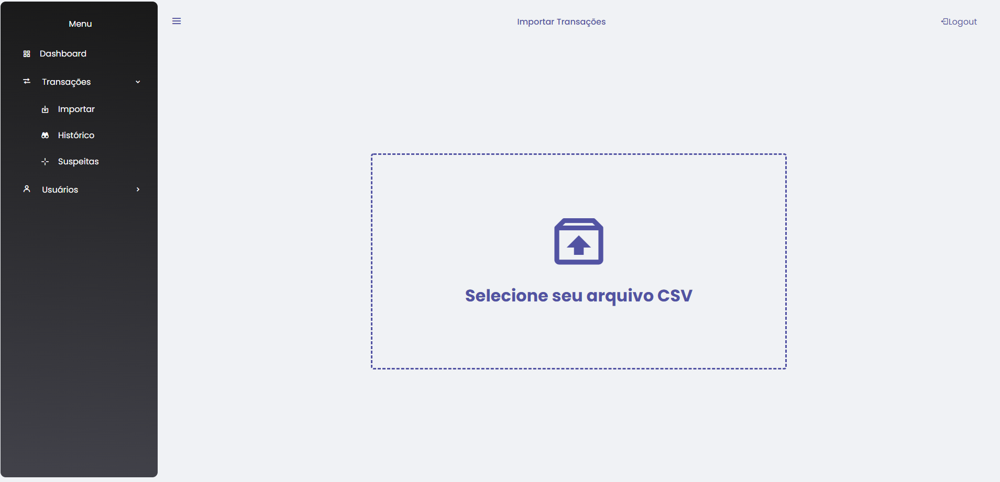
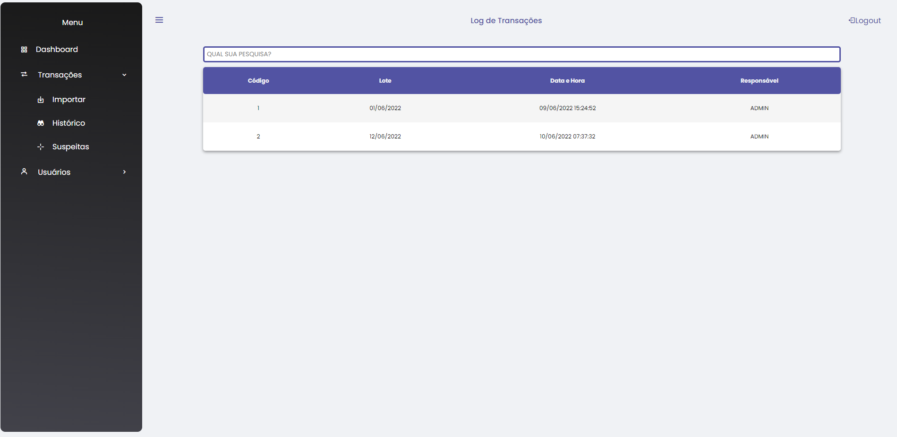
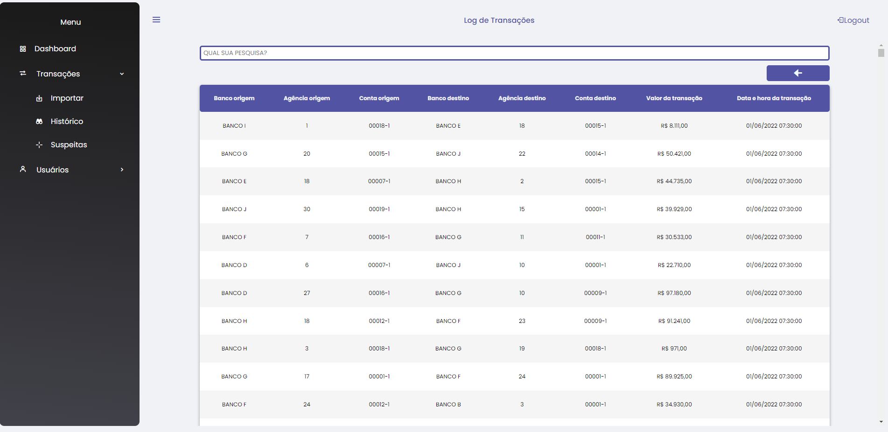

# Projeto de Registro e Avaliação de Transações Bancárias

Esta aplicação tem como principal objetivo analisar transações suspeitas e listar
as transações suspeitas. Este foi um projeto sugerido em um desafio da plataforma
de ensino ALURA, mas estou incrementado algumas funcionalidades não listadas
para este desafio, como exemplo a Tabela SQL de auditória de modificações
nos usuários e uma HomePage com Dashboards.

<!--ts-->
   * [Installation](#teste)
<!--te-->

## Status do Projeto

- Em Desenvolvimento
- 90% Completo
- Previsão de Término: 15/06/2022

## Tecnologia Usada

### Back-End

1. FLASK

### Front-End

1. JavaScript
2. CSS
3. HTML

### DataBase

1. Postgresql

### Infraestrutura

1. Docker
2. Heroku

## Funcionalidades

1. Autenticação de Usuário
2. Importar Transações Bancárias através de um arquivo CSV
3. Relatório Geral de Transalções
4. Histórico de Importações
5. Relatório de Suspeitas de Fraude
6. Cadastrar, Consultar, Alterar e Deletar usuário do sistema

## Como Ultilizar?

Podemos usar esta aplicação de 3 formas:

1. Acesso via página Web
2. Clonando o Repositório
3. Consumo da nossa API

### 1. Acessando Atráves da página Web:

Nossa app esta disponibilizado para uso atráves do link:

    http://transactions-analyzer.herokuapp.com/

#### 1. Login

Ao acessar o link, você irá se deparar com a nossa tela de login.

Para realizar o acesso criamos as credenciais de acesso para você testar:

    Nome do Usuário: ADMIN
    Senha: 123999

    obs: Nesta tela de login na região inferior a imagem econtramos um link para
    recuperação ou troca de senha. Esta funcionalidade esta em desenvolvimento.

#### 2. Home Page ( Navegação + Relatório Geral de Transalções )

Após realizar o login, o usuário é redirecionado para nossa home page

Esta tela é composta por: dashboards, menu superior e uma barra de menu lateral

Dashboard:

    Os dados contidos na Dashboard são relativos as transações importadas no mês vigente,
    desta forma representando um relatório geral das trasações relativas ao mês corrente.

Menu Superior:

    Essa região contém, a esquerda, o icone para recolher ou mostrar o menu lateral,
    na região central fica o nome da tela, neste caso "Dashboard", a direita encontramos
    o botão para relizar o logout da aplicação.

Menu Lateral:

    Atrávez do menu de acesso lateral você pode navegar por nossa aplicação e acessar
    todas nossas funcionalidades. Ele é composto por essa opções:
    
    1. Dashboard
    2. Transações
        2.1 Importar
        2.2 Histórico
        2.3 Suspeitas
    3. Usuários
        3.1 Gerenciar

#### 3. Importar Transações

Para acessar a tela de importação você irá escolher a opção do menu lateral:

    Transações >  Importar

Você será redirecionado para esta página

    Para escolher o arquivo desejado, clique na imagem com a seta apontada para cima.
    Ao escolher o arquivo a imagem irá mudar de uma seta para um V, o nome do arquivo
    irá aparece na tela e será habilitado um botão com nome "Enviar".
    Agora é só clicar em "Enviar"

#### 4. Histórico de Importações

Para acessar a tela de importação você irá escolher a opção do menu lateral:

    Transações >  Histórico

Você será redirecionado para esta página

Esta tela é composta por uma barra de pesquisa e logo abaixo uma tabela.

Barra de Pesquisa:

    Pra filtar os dados listados na tabela você pode digitar dentro deste campo a sua
    busca. A busca ocorre em todos os campos da tabela linha por linha.Caso não encontre
    o que você busca dentro de uma linha, ela será ocultada. 

Tabela:
    
    Esta tabela contém o log de transações realizadas. Cada arquivo importado através da
    opção Transações >  Importar é considerado um lote. Por exemplo: Um arquivo contendo
    transações do dia 01/06/2022 é considerado que essas transações fazem parte do lote
    01/06/2022. Dentro deste contexto esta tabela exibe o histórico de lotes importados.
    Caso deseje visualizar as transações contidas em um lote, você pode dar duplo click
    em uma das linha desta tabela. Ao realizar este procedimento uma nova tabela será
    exibida contendo as transações referente ao determinado lote da linha escolhida.

A nova tabela exibida será assim

    Esta nova tabela contém todas as transações contidas em um determinado lote. Podemos
    perceber que um botão com uma seta para esquerda foi habilitado logo acima da
    tabela. Este botão serve para retorna a tabela anterior, caso o usuário deseje
    verificar outro lote.

teste